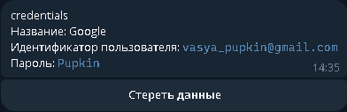

# School project:

## Индивидуальный проект по информатике за 9 класс на тему:
### Телеграм бот на Python - менеджер паролей.

- Бот использует технологии хеширования и шифрования
- Все данные хранятся в защищённом виде в базе
- Ключ шифрования пересоздаётся при каждой авторизации
- Пользовательские и учётные данные хранятся в разных базах

Модули использующиеся для хеширования и шифрования:

```python
from os import urandom
from base64 import b64encode, b64decode, urlsafe_b64encode
from bcrypt import gensalt, hashpw, checkpw
from cryptography.fernet import Fernet
from cryptography.hazmat.primitives.hashes import SHA256
from cryptography.hazmat.primitives.kdf.pbkdf2 import PBKDF2HMAC
from json import dumps, loads
```

Структура баз данных:

```SQL
CREATE TABLE IF NOT EXISTS users(
user_id INTEGER PRIMARY KEY,
master_password TEXT NOT NULL,
salt TEXT NOT NULL)

CREATE TABLE IF NOT EXISTS items(
id INTEGER PRIMARY KEY AUTOINCREMENT,
user_id INTEGER NOT NULL,
item TEXT NOT NULL ,
name TEXT NOT NULL,
info BLOB NOT NULL,
FOREIGN KEY (user_id) REFERENCES users (user_id) ON DELETE CASCADE)
```

Превью

